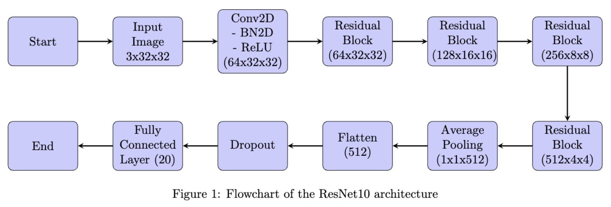

# Machine Learning Final Competition Report

**Author:** Mohamed Hendy (mmh10013)  
**Date:** December 2023  
**Final Grade:** A  
**Course Professor:** [Shengjie Wang](https://sheng-jie-wang.github.io/)

## Introduction

The ML final competition is an image recognition competition on Kaggle between 50 NYU Juniors and Seniors for CS360 Machine Learning. The dataset used is a variant of the famous CIFAR10 dataset but with 20 classes. We were given 50000 training images each of size 3x32x32, 50000 corresponding image labels, and 10000 test images. Although there was no limitation on which model and data augmentation to apply, the maximum number of layers allowed was 10 for any model. In this report, I demonstrate my experiments, hyperparameters, data augmentation, and detailed best-model breakdown.

## Experiments

| Name            | Details                                                                   | Accuracy |
| --------------- | ------------------------------------------------------------------------- | -------- |
| Plain Model     | 2 Conv Layers                                                             | 40%      |
| ResNet9 Layers  | Data Augmentation, SGD, No LR Scheduler                                   | 75%      |
| ResNet9 Layers  | Data Augmentation, Adam, Weight Decay, 1 Dropout layer                    | 77%      |
| ResNet10 Layers | Data Augmentation, Adam, Step LR Scheduler, Weight Decay, 1 Dropout layer | **81%**  |

Data augmentation includes RandomCrop, RandomHorizontalFlip, ColorJitter, and Normalize, all of which are PyTorch-supported transforms. **Note:** the provided definition of a layer is only restricted to computational layers. Therefore, the following layers don't count:

1. Any layer that does not have parameters to learn (max/mean-pooling, dropout, padding, flattening).
2. Some "supportive" layers with few parameters: any normalization layer (e.g., batchnorm, layernorm, etc.), and any activation function.

## ResNet10 Breakdown

The most capable model was ResNet10 with details shown in the above table. The 10-layer breakdown is as follows, 1 Conv Layer, 4 ResNet Blocks, 1 Full Connected Layer.

## Collaboration Note

Given the 10-layer depth requirement, it was crucial to try different optimization techniques. On top of that, discussions with:

1. The Learning Assistant Bale Chen (bc3008)
2. Friends Joshua (jxt208) and Jennifer (wy2074)

were highly effective.

## Conclusion

This report highlights my journey in the machine learning competition, showcasing the experiments, hyperparameters, data augmentation techniques, and the breakdown of our best-performing model, ResNet10. The competition provided valuable insights and allowed me to explore various techniques in image recognition.
